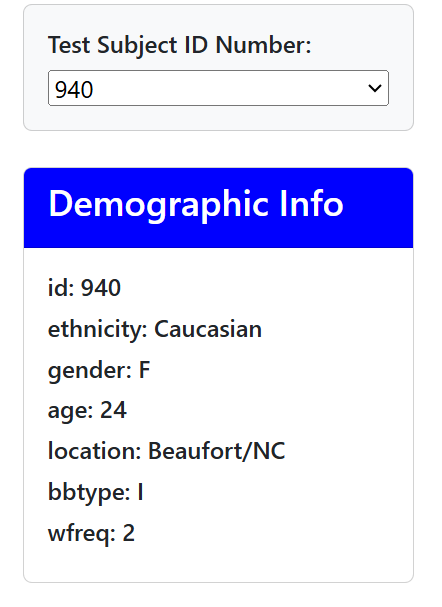
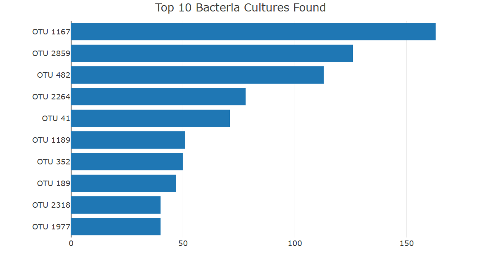
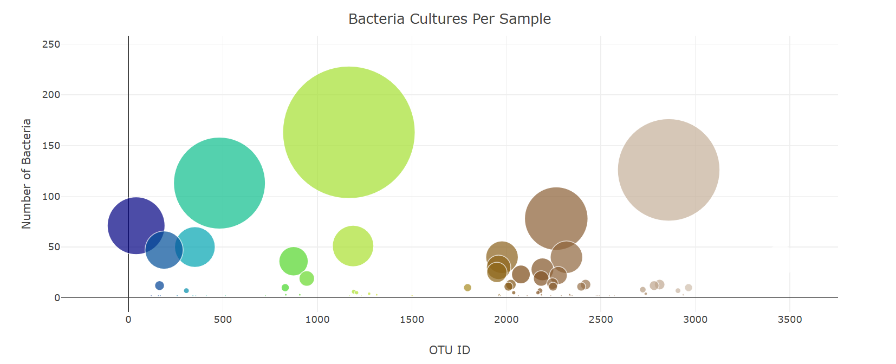

## Belly Button Biodiversity Dashboard

Purpose of this Project is to build a interactive dashboard to explore the Belly Button Biodiversity  which catalogs the microbes that colonize human navels.

Dataset: The dataset reveals that a small handful of microbial species (called  OTUs, in the study) were present in more than 70% of people, while the rest were relatively rare.

## Dashboard Creation Process

The backend of the dashboard, handled by JavaScript (`app.js`), is responsible for extracting, transforming, and loading the data subsets into the corresponding HTML tags and visuals.

## Libraries Used
- Plotly
- D3

## Languages Used
- **Frontend**: HTML
- **Backend**: JavaScript

## Data Visuals

- Create a horizontal bar chart with a dropdown menu to display the top 10 OTUs found in that individual.
  -  Use sample_values as the values for the bar chart.
  -  Use otu_ids as the labels for the bar chart
  - Use otu_labels as the hovertext for the chart.

- Create a bubble chart that displays each sample.
  - Use otu_ids for the x values.
  - Use sample_values for the y values.
  - Use sample_values for the marker size.
  - Use otu_ids for the marker colors.
  - Use otu_labels for the text values.

- Display the sample's metadata, 
  - i.e., an individual's demographic information.

## Dashboard Images:

## Github Pages
https://seyhr.github.io/belly-button-challenge/
